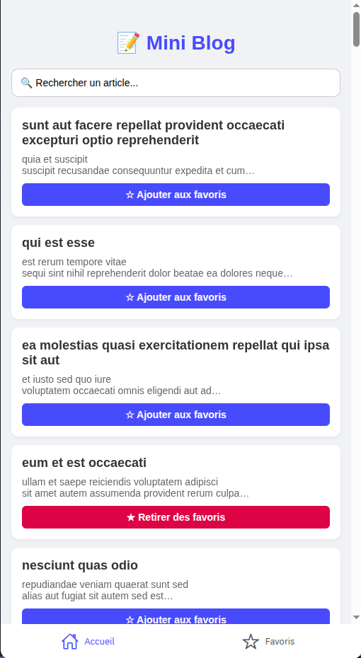
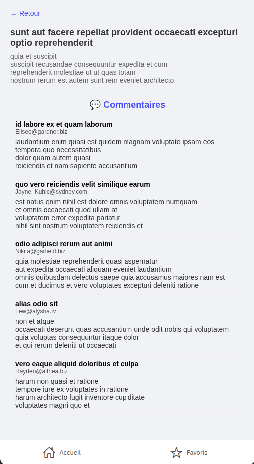
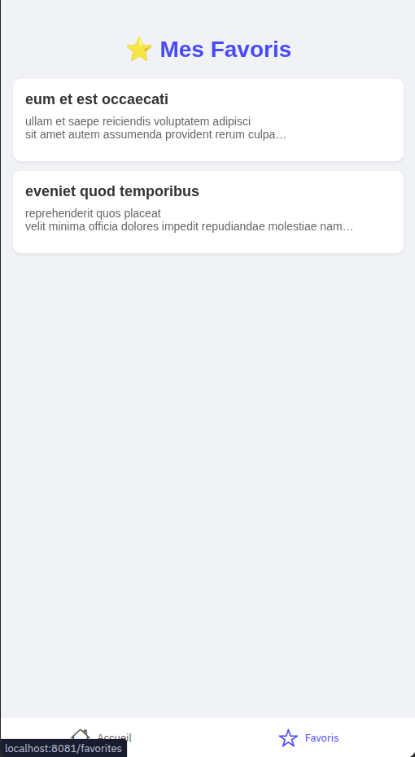

# MINI-BLOG 👋

## Description

Mini blog simple réalisé avec React Native et Expo.  
Permet de consulter des articles, les commenter, et gérer des favoris.

---

## Démarrage rapide

### 1. Installer les dépendances

```bash
npm install
````

### 2. Lancer l'application en mode développement

```bash
npx expo start
```

### 3. Lancer sur mobile (via tunnel)

```bash
npx expo start --tunnel
```

---

## Fonctionnalités

* Liste des articles récupérés depuis une API.
* Affichage détaillé d’un article avec ses commentaires.
* Recherche d’articles par titre.
* Gestion des favoris (ajout / suppression).
* Navigation entre les pages.

---

## Captures d’écran

### Liste des articles



### Détail d’un article



### Favoris



---

Merci d’avoir utilisé ce mini blog ! 😊

---
